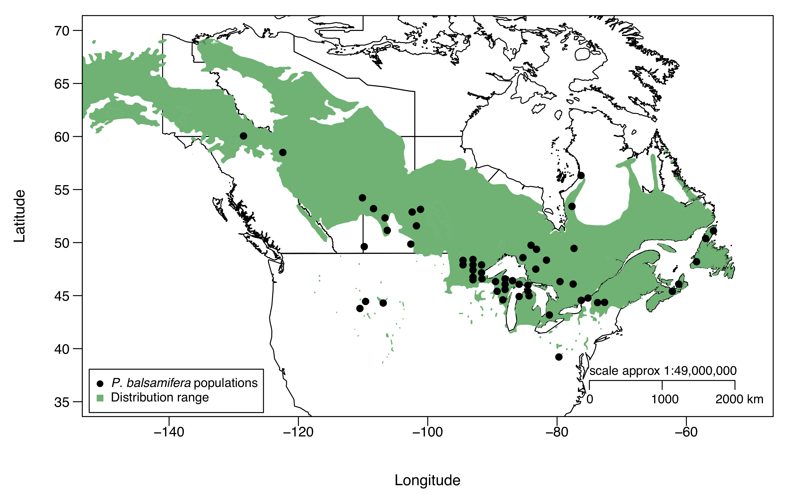
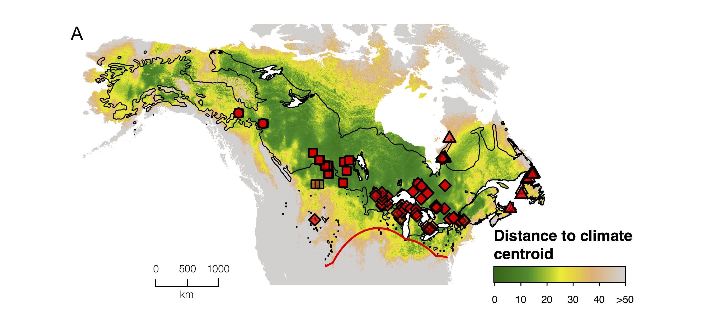

 

## 1. Background 

### 1.1 *Populus balsamifera* Distribution Range

</img>

 

### 1.2 Study Population Locations

</img>

### 1.3 Climate and Geography Considerations

</img>

 
### 1.4 Goals

- Study the matrix of allele frquencies in 57 populations

- Calculate population adaptive index (PAI)

- Compute multiple regression between two distances and PAI

- Plot the model fit surface to understand the differences between populations

